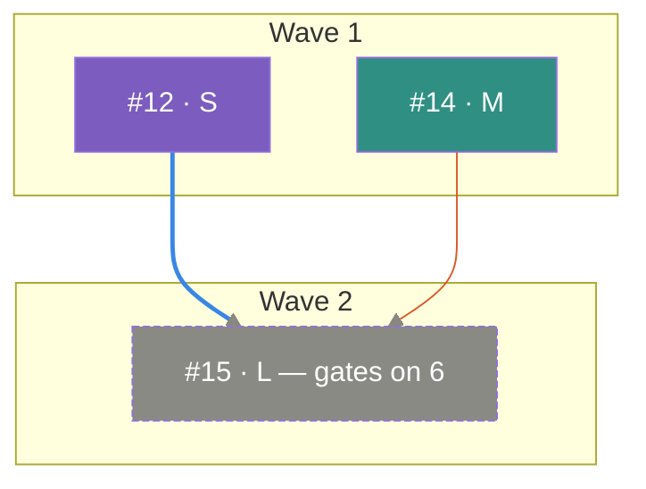

# Shared: dependency-graph rendering contract

One JSON model, two renderers. `scripts/epic_graph.py <owner/repo> <epic#>` computes waves, node metadata, and the critical path — that logic lives in exactly one place. Everything below is a **rendering contract**, not analysis: a renderer maps the model to pixels or to Mermaid text and does nothing else. If a renderer needs to know something the model doesn't carry, add the field to the script — don't let a renderer start inferring facts, or the two views will drift apart the same way prose and native edges did.

Consumers: `board`'s `--plan` SVG view, and its optional pinned-comment Mermaid view.

## Locating the script

The agent running a skill executes shell commands with the **target repo** as its working directory (e.g. the project the epic lives in), not this plugin's own install directory — a bare `scripts/epic_graph.py` won't resolve. Use:

```
python3 "${CLAUDE_PLUGIN_ROOT}/scripts/epic_graph.py" <owner>/<repo> <epic#>
```

`${CLAUDE_PLUGIN_ROOT}` is Claude Code's documented variable for a plugin's own install path, but as of this writing its expansion inside `SKILL.md`-driven shell commands is a known, open bug (it can resolve empty even though the same variable works reliably in hook/MCP JSON configs). If the command fails because the path doesn't exist, don't give up — locate the plugin's installed root yourself, e.g. `find ~ -path '*/workstream/scripts/epic_graph.py' 2>/dev/null | head -1`, and invoke that path instead. Every skill below that shells out to the builder should follow this same resolution, not repeat its own copy of the caveat.

## The model

```
{
  "waves": { "1": [12, 14], "2": [15] },
  "nodes": {
    "12": { "title": "...", "size": 1, "blockers": [], "leaf": false,
            "kind": "enabler", "labels": ["size:S"] },
    ...
  },
  "criticalPath": [12, 15]
}
```

- `size` — 1/2/3 for S/M/L (unlabeled defaults to 2/M).
- `leaf` — no other open node in this epic depends on it.
- `kind` — `enabler` (blocks others, isn't itself blocked), `closeout` (title starts `Verify:` — a to-subissues verification-closeout slice), or `behaviour` (everything else).
- `labels` — raw label names, passed through undecided. A renderer that cares about a repo-specific convention (e.g. a `descope-candidate` label, if the repo has one) reads it here. Don't guess at a label that doesn't exist — a node with no such label just renders as a normal node.

## SVG layout (board's `--plan`)

- `viewBox="0 <content-width+164> H"` — both dimensions grow with the graph. Gutter `x=40..112`: the wave's label (`Wave N` / `N parallel`). Content area starts at `x=124`.
- Box `w=120`, `h=50`, `gap=12` between boxes in a row — fixed regardless of graph size. Title baseline at `+22` from box top, subtitle at `+40`.
- **Never wrap a row past 4 boxes — widen the canvas instead.** An earlier version of this contract wrapped a row over 4 boxes into a second stacked sub-row. Don't do that: it silently inserts an extra row *inside* a wave, and any edge skipping from an earlier row to a later one now has to cross that extra row with no awareness it's there — on epic #143 this produced an edge that visibly cut straight through an unrelated box (confirmed by sampling the curve, not by eye). Instead: find `maxN`, the largest row size anywhere in the whole diagram (after the leaf/non-leaf split below); every row uses `boxW=120` and is *centered* within a shared content width of `maxN*120 + (maxN-1)*12`; `viewBox` width becomes `124 + that content width + 40`. A wave with only 1–2 nodes still renders centered and normal-sized inside the wider canvas — only the canvas grows, never the box count per row.
- **Route every edge as an orthogonal elbow, obstacle-aware — never a smooth diagonal curve.** A smooth bezier between two boxes has no notion of what sits between them; a diagonal curve routinely cuts across boxes that happen to be in its path (verified on epic #143's `#188 → #153` edge, which crossed directly through `#190`). Instead:
  1. Treat the diagram as an ordered stack of rows (each row = one leaf-row or non-leaf-row band, in top-to-bottom order across all waves), each with a known empty vertical gap above and below it — no box ever occupies a gap, at any `x`, by construction.
  2. For an edge from a box in row *i* to a box in row *j* (*j* > *i*): if *j = i+1* (adjacent, nothing in between), route a simple elbow — down from the source's bottom-center, a horizontal jog at the midpoint gap, down into the target's top-center.
  3. If *j > i+1* (one or more rows sit between them), those intermediate rows' boxes are obstacles. Check whether a straight vertical run at the target's `x`, or at the source's `x`, would clear every obstacle's horizontal span (with a few px of padding) all the way down — if either does, jog to that `x` in the first gap and run straight down it. If neither is clear, route via the **left margin lane** (`x≈100`, structurally outside the content area, so it can never collide with a box): jog left in the first gap, straight down the margin past every intermediate row, jog right into the target's `x` in the last gap before its row, then down into the target.
  4. Round each corner with a small radius (~8px) instead of a sharp right angle — same routing, just easier on the eye.

  This is the one rule in this contract to treat as load-bearing over the others if they ever conflict: a clean, uncrossed path matters more than a compact canvas or a perfectly smooth curve. Re-verify by sampling each rendered path against every box's interior (not by eye) before calling a render done — on epic #143 this took the crossing count from 1 confirmed collision to 0, checked geometrically across all 8 edges.
- **Fan edges across ports — never route two edges through the same exit or entry point.** Routing every edge's endpoint as a box's dead-center is wrong the moment two edges share a source or a target: they trace the *identical* pixels for the shared portion of their path, and only the last one drawn is visible — the earlier edge doesn't render wrong, it renders invisible. Confirmed on epic #143: `#188` has two outgoing edges (to `#153` and `#155`) that both left from its exact center and overlapped completely until they diverged; `#153` has two incoming edges (from `#188` and `#217`) that both arrived at its exact center the same way. Fix: for a node with *N* outgoing edges, spread their exit points evenly across its bottom edge (inset ~20px from each side) instead of sharing one point; do the same for incoming edges across the top. Order the ports by the *other* endpoint's `x` position (leftward targets/sources get leftward ports) so the fan-out still reads as spatially sensible, not arbitrary. A node with only one edge on a given side keeps the simple center point — fanning only matters once there's more than one to separate. Re-verify the same way as the routing rule above: sample each edge's path and confirm no two edges share more than their shared start/end box — on epic #143 this took 2 confirmed full-segment overlaps to 0.
- **Band each wave with an alternating background tint.** The gap between a wave's own leaf/non-leaf rows (the sub-row split below) is necessarily smaller than the gap between two different waves, but on a real graph that difference alone isn't always enough to read as "these rows are grouped, those aren't" — especially when most of a wave's nodes already sit on one shared row and look like a self-contained group on their own (epic #143's wave 1: 6 of 7 nodes on one row). Fill a full-width, low-opacity rect (`#ffffff08` on the dark surface) behind every other wave's full vertical span (padded ~10px top/bottom), drawn before the wave-label text and before any box or edge — alternating so adjacent waves are never both tinted or both untinted. This makes the grouping explicit instead of inferred from spacing.
- **Within a wave, split by out-degree, not by whatever order the model returns.** Nodes with `leaf: true` go on the wave's top row; nodes with `leaf: false` (they feed a later wave) go on the bottom row. This is the change that keeps arrows from slashing through boxes — a blocker sitting below the thing it blocks draws a backwards-looking edge.
- **Order nodes within each row by a barycenter sweep, never by node number.** Sorting a row by raw issue number is the single biggest source of visual mess — the node with the most connections lands wherever its number happens to fall, not where its edges want it, and every edge into or out of it becomes a long diagonal. Fix it with the standard two-pass layered-graph ordering:
  1. **Bottom-up pass**, processing waves from last to first: for each node, its sort key is the mean position-rank of its *successors* (nodes that list it as a blocker) among those already ranked in this pass. A node with no successors yet ranked (the last wave, or a leaf with nothing downstream) falls back to its raw id. Assign a running rank in this order, restarting per row (leaf row, then non-leaf row) but continuing to increment across the whole sweep.
  2. **Top-down pass**, processing waves from first to last: same idea, but the sort key is the mean rank of each node's *predecessors* (its own `blockers`), using ranks from *this* pass where available and falling back to the bottom-up pass's rank otherwise.
  3. Use the top-down pass's final ranks to order each row before assigning `x` positions (and before chunking a row that wraps past 4).

  This is what "minimize crossings" means in layered graph drawing generally (Sugiyama-style: layer, then order, then place) — layering (waves) and placement (the box-position table above) were already specified; ordering was the missing middle step. On epic #143's real graph this took total horizontal edge travel from 792px to 528px and the worst single edge from 264px to 198px, just by moving the busiest node out of a corner it landed in by chance of numbering.
- **Suppress high-fan-in edges — except the critical-path one.** If `blockers.length >= 4`, draw none of that node's incoming edges except the one that's a `criticalPath` step — put `gates on N` in its subtitle regardless (`N` = the full blocker count, including the one edge still drawn). A real epic's verification-closeout slice routinely blocks on everything, and the critical path frequently runs straight through it; suppressing that edge along with the noise would erase the one signal `--plan` exists to show.
- Title text: truncate/wrap to **≤12 characters** — the box is 120px and body text at 14px/weight 500 runs ~7.6px/char, so much more overflows. Subtitle is `#<num> · <S|M|L>`.
- **Box fill by `kind`**: `enabler` = purple, `behaviour` = teal, `closeout` = gray. This is a separate color channel from edge color below — a box's fill says what the node *is*, a line's stroke says which edge it *is*, and they must stay visually distinguishable as different kinds of color (fill vs. thin stroke) rather than fighting for the same meaning.
- A node whose `labels` includes a repo's descope-candidate convention (if one exists) renders with a **dashed** rect border instead of solid.
- **Every edge gets its own color — don't collapse the critical path into one shared hue.** An earlier version of this contract colored every edge either coral (on the critical path) or gray (everything else); on a real epic with a 4-hop critical path, that meant three different, unrelated edges all rendered identically, which is exactly backwards when the goal is to trace one specific dependency by eye. Instead:
  1. Take the default categorical palette from the `dataviz` skill (`references/palette.md`), dark-mode column, 8 hues. Before using it, run `scripts/validate_palette.js` (from that skill) against the graph's actual surface color — don't assume the shipped values pass on a surface other than the skill's own reference dark surface; re-validate if you change the background.
  2. Build the edge list in the **same fixed order** the Mermaid section below uses for `linkStyle` indices (waves ascending → node ascending within wave → blockers ascending, skipping suppressed edges per the fan-in rule) — this keeps hue assignment identical between the SVG and Mermaid renderers for the same epic.
  3. Assign palette slot `i` to edge `i` (0-indexed). **Past 8 edges, stop** — a 9th edge does not get a generated or cycled hue (cycling creates false identity: two visually identical edges that are not the same edge). Beyond the 8th, fall back to the old neutral `#888780` for the stroke.
  4. The critical path is marked by **stroke width alone** now (`2px` vs. `1.25px`), decoupled from hue — every edge already has a unique identity; width is what says "and this one's on the critical path."

Hand the finished SVG to the visualize widget — don't put prose in that call, the SVG is the whole payload. If no such widget is available in the current environment, fall back to a fenced ```svg block in the response instead of silently dropping the visual.

## Mermaid mapping (board's pinned comment)

GitHub renders Mermaid in issue/PR comments; it will not render the SVG above. This is a lower-fidelity, GitHub-native secondary view of the **same model** — don't let it diverge in what it claims, even though its layout precision is weaker than the SVG's (Mermaid doesn't give per-row placement control the way raw SVG does).



Rules:

- One `subgraph` per wave, in wave order, titled `Wave N`.
- Emit edges in a fixed, deterministic order (iterate waves ascending, nodes ascending, blockers ascending, skipping suppressed edges) so `linkStyle <index>` can target the right ones — Mermaid styles edges by draw order, not by name. This is the same order the SVG section uses to assign hues, so index `i` here gets palette slot `i` there too.
- Apply the same fan-in suppression as the SVG: skip drawing an edge into a node with `blockers.length >= 4`, and append ` — gates on N` to that node's label instead.
- **Per-edge color, same as the SVG**: `linkStyle <i>` gets palette slot `i` (validated per the SVG section's rule) for the first 8 edges; `linkStyle default` (the neutral `#888780`) covers anything past the 8th. Critical-path edges get extra `stroke-width` (`2.5px` vs. `1px`) on top of their own color — never a shared override color; Mermaid doesn't support per-edge width as cleanly as SVG does, so lean on the wider stroke-width value being the signal.
- `classDef`/`class` carries `kind` the same way fill color does in the SVG; the closeout class also carries the dashed treatment mermaid supports natively via `stroke-dasharray`.
- Port fanning (the SVG rule above) doesn't apply here — Mermaid routes its own edges and already separates multiple edges touching one node, so there's nothing to fix on that front. The wave-band tint does translate: `style W1 fill:#ffffff08` (alternating per subgraph) gives the same explicit grouping Mermaid's own subgraph borders don't always make obvious next to a busy row.

Upsert this fenced block into one comment on the epic, matched by an HTML marker (`<!-- workstream:graph -->`) so re-running this edits the same comment instead of piling up new ones.
